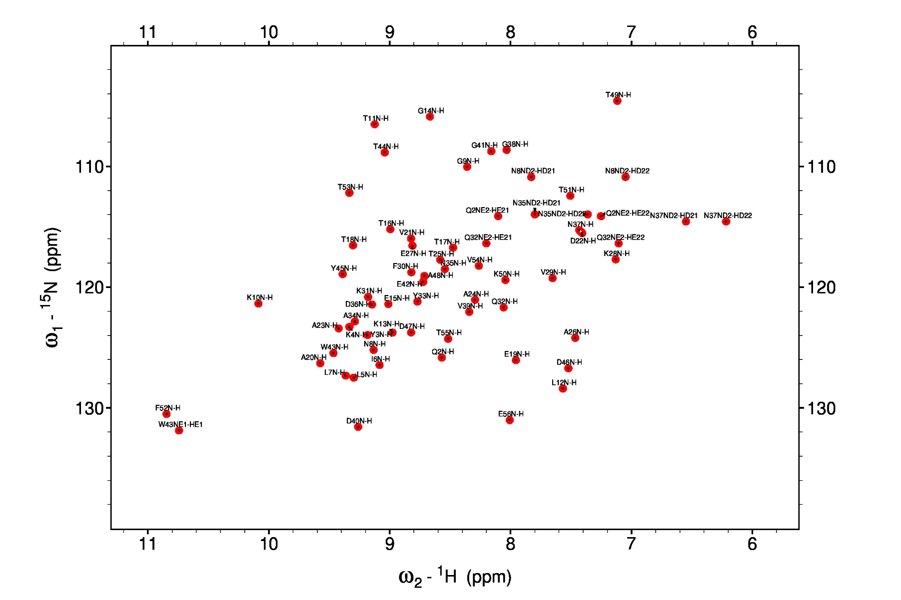
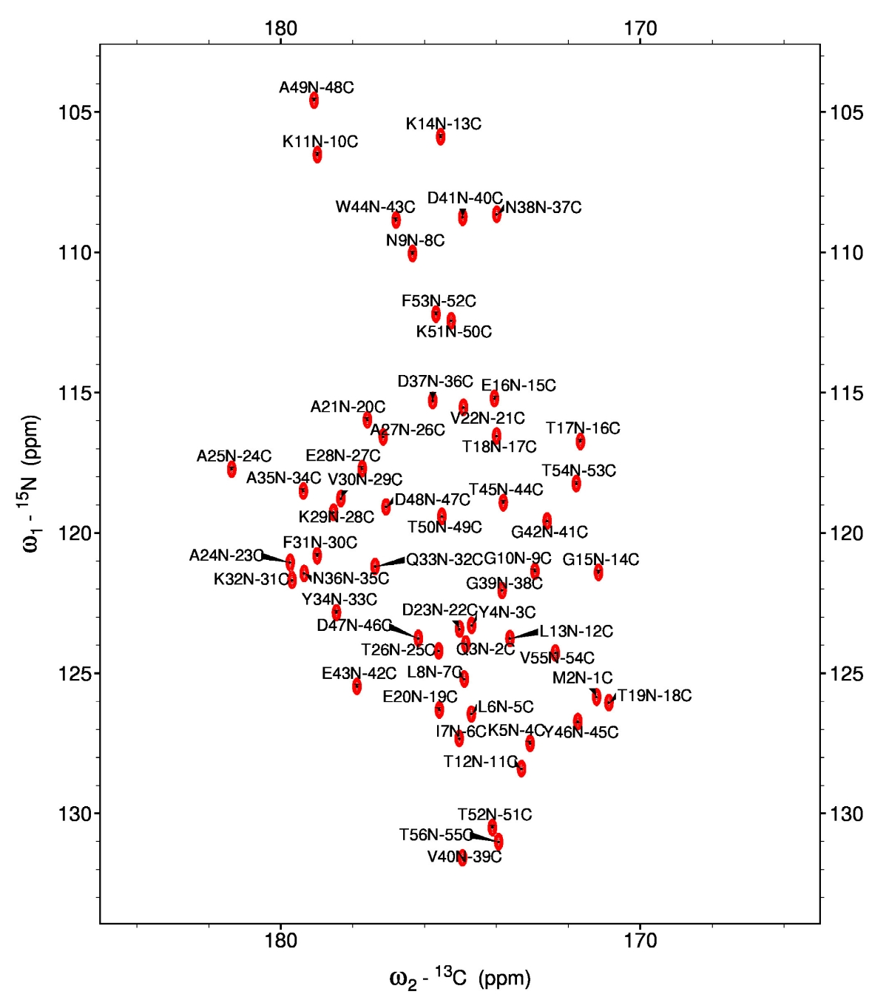
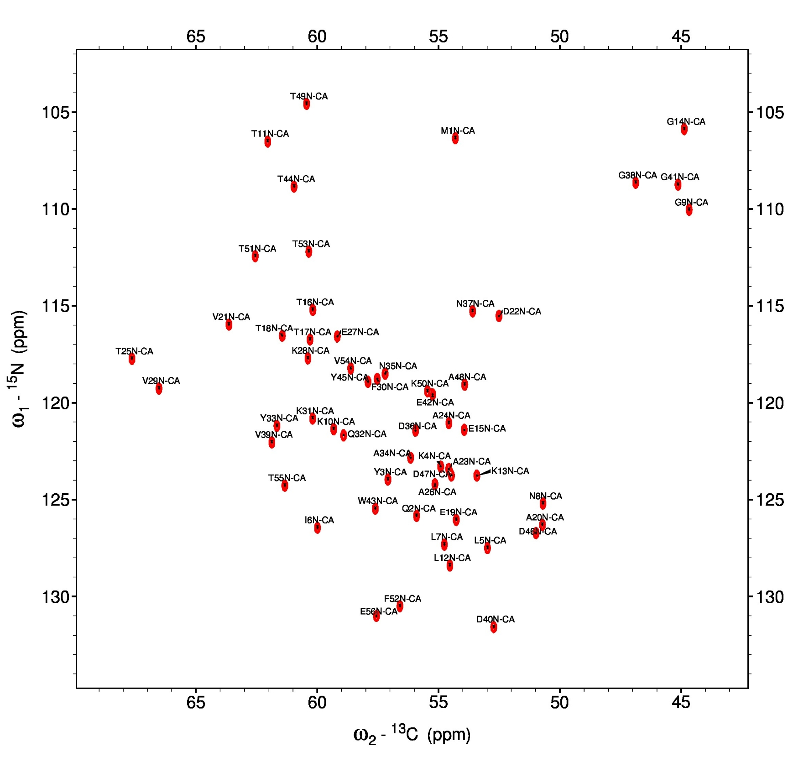
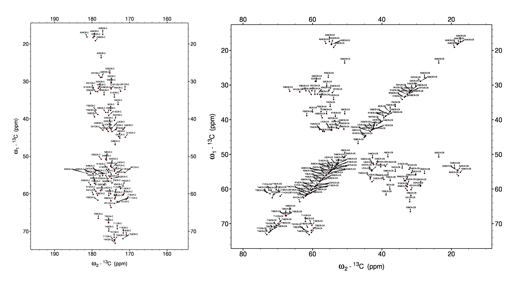

# sim-sparky

Simulate 2D NMR spectra in Sparky format from a peak list file.

## Description

Sim-Sparky is a python tool to simulate several types of 2D NMR spectra (i.e., HN-HSQC, HC-HSQC, NCA, NCO, DARR etc.) from a peak list files obtained from the BMRB database or ShiftX prediction server. The tool is built on top of NMRGlue, which allows it to simalute peaks as Gaussian lineshapes directly into Sparky format. A peak list file, also in Sparky format, is generated and can be loaded into Sparky with the spectrum.

## Requirements

* Python 3. I recommend installing the [Anaconda Package](https://www.anaconda.com/distribution/#download-section), which has many additional libraries pre-installed.
* [NMRGlue](https://nmrglue.readthedocs.io/en/latest/install.html). This is an additional Python library for read/writing/processing NMR spectra. 
* [NMRFAM-SPARKY](https://nmrfam.wisc.edu/nmrfam-sparky-distribution/). This is required to visualize file outputs.

## Installation

Simply download and copy the [sim_sparky.py](sim_sparky.py) script into a working directory. Usage:

	python sim_sparky.py --help
	usage: sim_sparky.py [-h] [-i INFILE] [-o OUT_PREFIX] [-t {csv}]
        	             [-c INTRA_CORR [INTRA_CORR ...]]
               	         [-s INTER_CORR [INTER_CORR ...]]
                	     [--nuc1_label NUC1_LABEL] [--nuc2_label NUC2_LABEL]
                       	 [--nuc1_freq NUC1_FREQ] [--nuc2_freq NUC2_FREQ]
                      	 [--nuc1_center NUC1_CENTER] [--nuc2_center NUC2_CENTER]
                    	 [--nuc1_sw NUC1_SW] [--nuc2_sw NUC2_SW]
                     	 [--nuc1_size NUC1_SIZE] [--nuc2_size NUC2_SIZE]
                     	 [--nuc1_lw NUC1_LW] [--nuc2_lw NUC2_LW]

	Simulate spectra from peak list.

	optional arguments:
	  -h, --help            show this help message and exit
	  -i INFILE, --infile INFILE
        	                Input file name with accepted format.
	  -o OUT_PREFIX, --out_prefix OUT_PREFIX
                        	Output prefix for peak list (.list) and spectrum (.ucsf) file. Default: hsqc.
	  -t {csv}, --file_type {csv}
	                        Input file format. Default: CSV (r_id, r_name, a_name, shift)
 	  -c INTRA_CORR [INTRA_CORR ...], --intra_corr INTRA_CORR [INTRA_CORR ...]
	                        Pair-wise intra-residue peak correlations. Default: H N HD21 ND2 HD22 ND2 HE21 NE2 HE22 NE2 HE1 NE1. (I.e. H-N HSQC).
	  -s INTER_CORR [INTER_CORR ...], --inter_corr INTER_CORR [INTER_CORR ...]
                        	Sequential connectivities. Default: 0 (I.e. Intra-residue connections only, H-N HSQC.).
  	 --nuc1_label NUC1_LABEL
                        	Label for nucleus 1 (direct dimension). Default: 1H.
 	 --nuc2_label NUC2_LABEL
                        	Label for nucleus 2 (indirect dimension). Default: 15N.
 	 --nuc1_freq NUC1_FREQ
                        	Frequency of nucleus 1 in MHz. Default: 600.00.
	 --nuc2_freq NUC2_FREQ
                        	Frequency of nucleus 2 in MHz. Default: 60.7639142.
  	 --nuc1_center NUC1_CENTER
                        	Center position of nucleus 1 in PPM. Default: 8.30.
  	 --nuc2_center NUC2_CENTER
                        	Center position of nucleus 2 in PPM. Default: 120.00.
  	 --nuc1_sw NUC1_SW      Spectral width of nucleus 1 in PPM. Default: 8.00.
	 --nuc2_sw NUC2_SW      Spectral width of nucleus 1 in PPM. Default: 40.00.
	 --nuc1_size NUC1_SIZE
                       		Number of points in nucleus 1 dimension. Default: 1024.
  	 --nuc2_size NUC2_SIZE
                        	Number of points in nucleus 2 dimension. Default: 1024.
  	 --nuc1_lw NUC1_LW      Peak linewidths in dimension of nucleus 1 in Hz. Default: 20.
  	 --nuc2_lw NUC2_LW      Peak linewidths in dimension of nucleus 2 in Hz. Default: 20.

## Examples

The following examples use the [GB1_BMRB30088_CSV.dat](examples/GB1_BMRB30088_CSV.dat) as the input file. These are the chemical shifts of GB1 deposited in the [BMRB database](http://www.bmrb.wisc.edu/data_library/summary/?bmrbId=30088) extracted and organized into a tab-delimited (TSV) text file (CSV also acceptable). This can be done by simply copying data from NMR-STAR files into MS Excel or LibreOffice Calc, then copying the required columns into a text file. Later versions of this code will allow direct reading of NMR-STAR files.

### 1H-15N HSQC spectrum

The following run by copying the [gb1_hsqc.sh](examples/sim_hsqc.sh) bash script into the working directory and running in a terminal:

	bash gb1_hsqc.sh

or copying the following into the terminal:

	python gb1_sparky.py \
       -i GB1_BMRB30088_CSV.dat \ 
       -o gb1_hsqc \
       -t csv \
       -c H N HD21 ND2 HD22 ND2 HE21 NE2 HE22 NE2 HE1 NE1 \
       -s 0 \
       --nuc1_label 1H \
       --nuc2_label 15N \
       --nuc1_freq 600.0000000 \
       --nuc2_freq 60.7639142 \
       --nuc1_center 8.30 \
       --nuc2_center 120.00 \
       --nuc1_sw 8.00 \
       --nuc2_sw 40.00 \
       --nuc1_size 1024 \
       --nuc2_size 1024
      
   This will output [gb1_hsqc.list](examples/gb1_hsqc.list) and [gb1_hsqc.uscf](examples/gb1_hsqc.list) files. First load the gb1_hsqc.ucsf spectrum into SPARKY then load the corresponding  gb1_hsqc.list file using the "rp" option. This should look like:
   
 <figure>
	
</figure>

### NCO spectrum

This example produces an NCO spectrum by correlating the carbonyl carbon with the nitrogen of the  i+1 residue. Note that inter-residue correlations are handled by the "-s" flag. Either run the [gb1_nco.sh](examples/gb1_nco.sh) script by:

	bash gb1_nco.sh

or copy the following into the terminal:

	python sim_sparky.py \
       -i GB1_BMRB30088_CSV.dat \
       -o gb1_nco \
       -t csv \
       -c C N \
       -s 1 \
       --nuc1_label 13C \
       --nuc2_label 15N \
       --nuc1_freq 150.903 \
       --nuc2_freq 60.834 \
       --nuc1_center 175.00 \
       --nuc2_center 120.00 \
       --nuc1_sw 20.00 \
       --nuc2_sw 40.00 \
       --nuc1_size 1024 \
       --nuc2_size 1024
       
This produces the [gb1_nco.list](examples/gb1_nco.list) peaklist file and the [gb1_nco.ucsf](examples/gb1_nco.ucsf) spectrum:

 <figure>
	
</figure>

### NCA spectrum

An example of simulating an NCA spectrum. Either run the [gb1_nca.sh](examples/gb1_nca.sh) script by:

	bash gb1_nca.sh

or copy the following into the terminal:

	python sim_sparky.py \
       -i GB1_BMRB30088_CSV.dat \
       -o gb1_nca \
       -t csv \
       -c CA N \
       -s 0 \
       --nuc1_label 13C \
       --nuc2_label 15N \
       --nuc1_freq 150.903 \
       --nuc2_freq 60.834 \
       --nuc1_center 57.50 \
       --nuc2_center 120.00 \
       --nuc1_sw 40.00 \
       --nuc2_sw 40.00 \
       --nuc1_size 1024 \
       --nuc2_size 1024

This produces the [gb1_nca.list](examples/gb1_nca.list) peaklist file and the [gb1_nca.ucsf](examples/gb1_nca.ucsf) spectrum:

 <figure>
	
</figure>

### DARR spectrum

The following produces a DARR spectrum of intra-residue correlations. Note that the reverse correlations are also specified with the "-c" flag so the cross-peaks are placed on both sides of the diagonal. Either run the [gb1_darr.sh](examples/gb1_darr.sh) script by:

	bash gb1_darr.sh

or copy the following into the terminal:

	python sim_sparky.py \
       -i GB1_BMRB30088_CSV.dat \
       -o gb1_darr \
       -t csv \
       -c C CA C CB CA CB CA C CB C CB CA C C CA CA CB CB \
       -s 0 \
       --nuc1_label 13C \
       --nuc2_label 13C \
       --nuc1_freq 150.903 \
       --nuc2_freq 150.903 \
       --nuc1_center 100.00 \
       --nuc2_center 100.00 \
       --nuc1_sw 200.00 \
       --nuc2_sw 200.00 \
       --nuc1_size 1024 \
       --nuc2_size 1024

This produces the [gb1_darr.list](examples/gb1_nca.list) peaklist file and the [gb1_darr.ucsf](examples/gb1_nca.ucsf) spectrum:

 <figure>
	
</figure>

More intra-residue correlations can be simulated by the following (contributed by Rashik Ahmed, McMaster University):

	python sim_sparky.py \
       -i GB1_BMRB30088_CSV.dat \
       -o gb1_darr \
       -t csv \
       -c -c C CA CA C CA CB CB CA CB CG CG CB CB CG1 CG1 CB CB CG2 CG2 CB CG CD1 CD1 CG CG CD2 CD2 CG CG CD CD CG CG1 CD CD CG1 CD1 CE1 CE1 CD1 CD2 CE2 CE2 CD2 CD CE CE CD C C CA CA CB CB CG CG CG1 CG1 CG2 CG2 CD CD CD1 CD1 CD2 CD2 CE CE CE1 CE1 CE2 CE2 \
       -s 0 \
       -s 0 \
       --nuc1_label 13C \
       --nuc2_label 13C \
       --nuc1_freq 150.903 \
       --nuc2_freq 150.903 \
       --nuc1_center 100.00 \
       --nuc2_center 100.00 \
       --nuc1_sw 200.00 \
       --nuc2_sw 200.00 \
       --nuc1_size 1024 \
       --nuc2_size 1024

## Funding sources

National Institutes of Health: 

* R01 GM 064742 (Gianluigi Veglia)
* R01 HL 144130 (Gianluigi Veglia)

American Heart Association:

* 19POST34420009 (Daniel K. Weber)